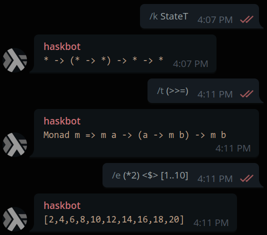

[](LICENSE)
[](https://travis-ci.com/vyorkin/haskbot)

# Haskbot

Telegram bot for Haskellers.
This is a work in progress, not ready for usage yet.



## Warning

I’m still a Haskell beginner, so I may do things wrong.

## Building

I hope you won’t try to build it locally, but anyway…

Run these commands in the project root directory:

```sh
echo "optional-packages: vendor/**/*.cabal" > cabal.project.local
mkdir vendor
git clone --single-branch --branch add-monad-fail-inst https://github.com/vyorkin/telegram-bot-simple.git vendor/
make all
```

To run a Telegram bot you need to create one first, by asking
[BotFather](https://telegram.me/botfather) — a specialised bot
that allows you to create new bots.

Then, create your own config:


```sh
cp config.example.toml config.toml
```

Edit the `config.toml` to set your bot token.

Now you can run your bot (hopefully).
